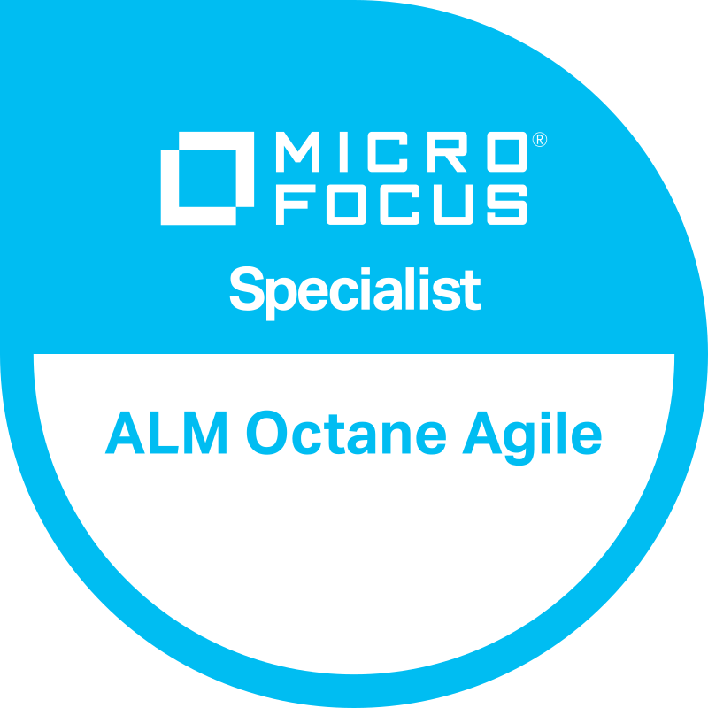

# AUTOMATION TEST ENGINEER 

#### Technical Skills: Python, Selenium, POM/Py Test, Microfocus UFT/QTP, Tricentis Tosca, Microfocus ALM Project, Microfocus ALM Administration, Microfocus ALM OTA, SQL, Postman

## EDUCATION								       		
- MTECH, Software Engineering | BITS Pilani University  (2012 — 2016)	 			        		
- BSC, PCM | SDM DEGREE College, Ujire (2009 — 2012)

## PROFILE
With 11+ years of experience in software testing, including 4 years of onsite experience in the UK, I specialize in automation testing using tools like Selenium, Pytest, and Microfocus UFT , Tosca. Certified in multiple automation frameworks, I have a proven track record of developing end-to-end testing solutions and improving operational efficiency.

## EMPLOYMENT HISTORY
### Functional Test Lead at Wipro, BANGALORE, INDIA   - June 2012 — Present
- Performing Test Lead role for IT enhancement projects, working with Project Management and coordinating testing backlog.
- Produce QA governess artifacts Master Test Plan, EOTR and Requirement Traceability Matrix.
- Involved in test case preparation, test case execution and reporting.
- Performed regression testing, SIT, script management, and preparing test suites.
- Documented manual test cases, review test progress and updated the status.

### Automation
- Developed and executed automated test scripts using Selenium WebDriver and Python
- Developed SAP regression test suit using UFT.
- Developed E2E automation of Oracle applications using Tosca.
- Build Reporting framework using OTA.
- Built Reporting framework using Microsoft Power Query, Power Automate and Power BI.
- Create ALM utility to reduce manual efforts.
- One click solution for Test and Defect status report with required metrics and KPI from ALM.
- Hands on experience in preparing Automated Tests, Test Data and executing the same.
- Experience in preparation keyword driven and BPT and Hybrid automation framework.
- Knowledge of descriptive programming, objects identification, and file system operations.
- Working knowledge on Web, SAP, Oracle , SQL DB and files System based Projects.
- Working knowledge Api Testing via Postman.
- Training knowledge on CI/CD pipeline.

### Micro Focus ALM Administration
- Hands-on experience with Users management, Project customizations. 
- Project workflows are done using VB scripting. 
- Report extractions are done from HP ALM database using Oracle SQL queries. 
- Day-to-day activities done in HP ALM are automated to a great extent using HP ALM OTA/APIs and MS Excel macros.
- Migration and upgradation of HP ALM. 
- Providing HPQC Training to End users. 
- Prepared Excel reports from HP ALM or QC using SQL queries. 
- Integrated HP ALM with other 3rd party tools JIRA. TOSCA, Selenium

## CERTIFICATIONS
- Wipro Certifications , DevOps Professional Certification Program
- Micro focus UFT One Tester Specialist 
- ALM_Manual_Tester_Specialist Micro Focus 
- ALM_Automation_Tester_Specialist Micro Focus 
- ALM_Project_Manager_Specialist Micro Focus 
- Micro focus RPA Specialist 
- Micro focus Octane Agile Specialist 
- TOSCA Test Automation Specialist Level-1 & Level-2 
- Automation Specialist for Databases TRICENTIS 
- Automation Specialist for API 11.x TRICENTIS 
- Tosca Query Language TRICENTIS

## AWARDS AND RECOGNITIONS
- Habit Flagbearer – Building Trust 
- Feather In My Cap 
- Pleasure to work with you

## PROJECTS
- Automated Oracle Regression Suite: Reduced execution time by 20% using Tosca.
- Reporting Framework Development: Created Power BI dashboards for QA metrics.
- ALM Utility: Built an MS Excel-based tool to streamline defect status reporting.

### BADGE

<!--  -->